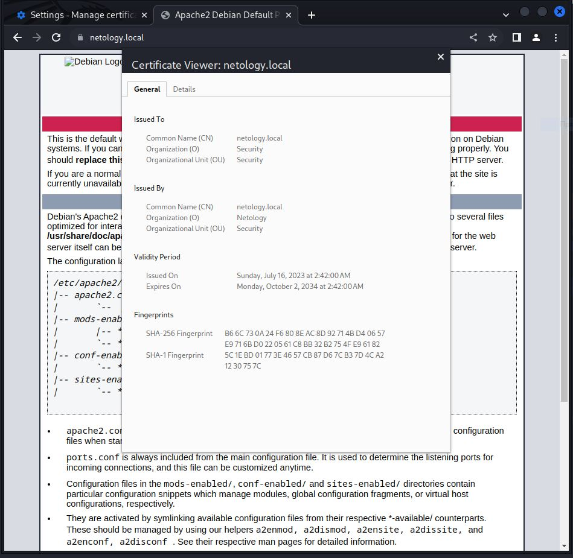
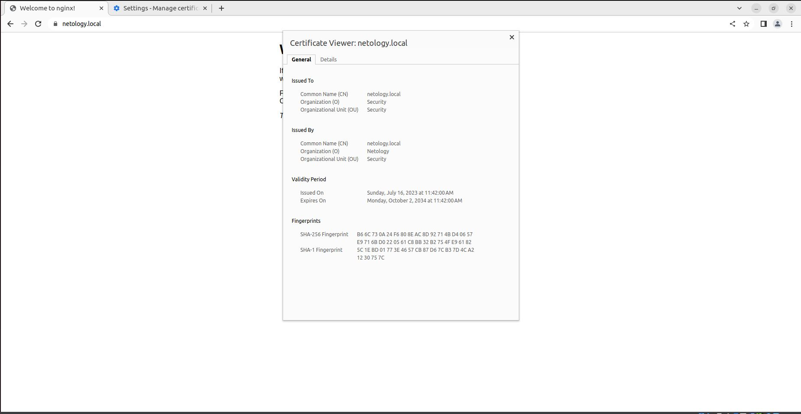
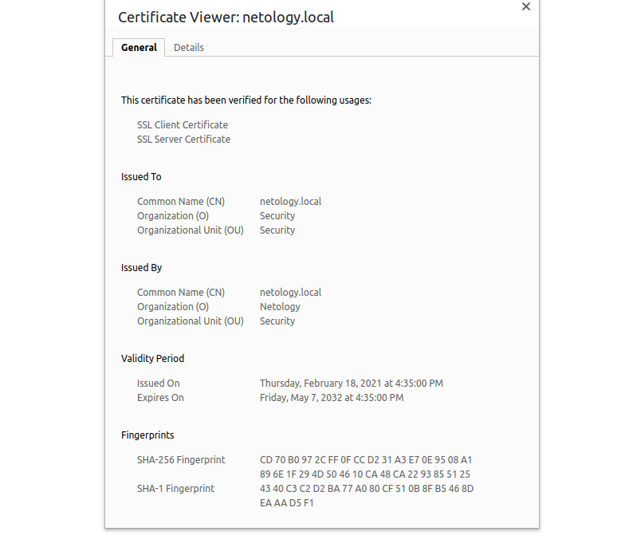
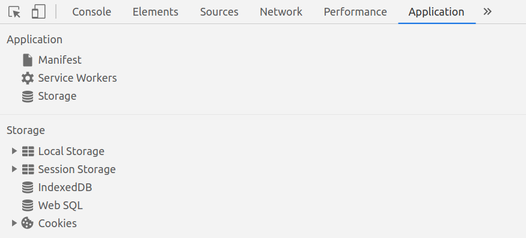
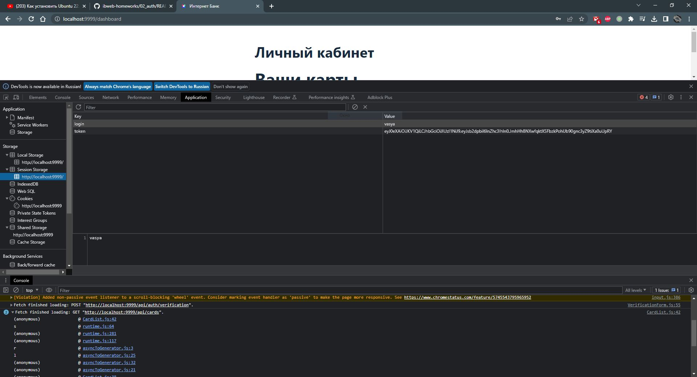
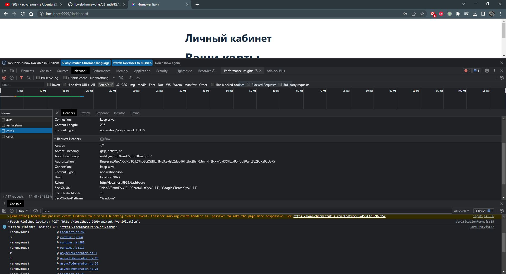

# Домашнее задание к занятию «Механизмы идентификации, аутентификации, авторизации и безопасного хранения данных о пользователях»

Пришлите ответы на вопросы в личном кабинете на сайте [netology.ru](https://netology.ru).

## Задание аутентификация по сертификатам X.509

### Описание

Вы настроите аутентификацию клиентов по сертификатам X.509 на nginx. Вместо nginx можно использовать любой web-сервер, в том числе самописный или встроенный в целевое приложение.

Для повторения теории по сертификатам и цепочкам доверия пересмотрите лекции 1 и 2.

### Решение задания

Для выполнения задания пришлите документы:

1. Файлы [ca.crt](./assets/ca.crt), [client.pfx](./assets/client.pfx), [server.crt](./assets/server.crt). Пароль для импорта `quest`
2. Скриншот страницы с информацией о сертификате.
   - Kali
   
   - Ubuntu
   

## Задание «Аутентификация»

Это задание необязательное. Его невыполнение не влияет на получение зачёта по домашнему заданию.

### Описание

Разработчики подготовили прототип будущей системы интернет-банка. Для запуска можно использовать команду `docker run -p 9999:9999 ghcr.io/netology-code/ibweb-auth:latest`.

Для входа используйте данные (сервис предоставляет веб-интерфейс на 9999 порту):
* логин/пароль: vasya/qwerty123;
* код подтверждения: 12345.

### Задача

Используя инструменты разработчика браузера, исследуйте, где приложение хранит токен и как его отправляет с каждым запросом после аутентификации. Мы рекомендуем использовать браузеры Google Chrome или Chromium.

### Этапы выполнения

1\. Аутентифицируйтесь под этой учётной записью.

2\. Откройте инструменты разработчика (Ctrl + Shift + I либо F12) и перейдите на вкладку `Application`.

3\. Исследуйте раздел `Storage` и выясните, в каком хранилище хранится токен доступа.

4\. Подтвердите результаты своих исследований: удалите токен доступа и обновите страницу, находясь на странице личного кабинета. Вас должно «перебросить» на страницу входа.

5\. Снова аутентифицируйтесь и исследуйте панель `Network` на предмет запросов, которые отправляет браузер, а именно `/api/cards`.

6\. Выясните, в какой части запроса отправляется токен доступа.

### Решение задания

В качестве результата пришлите информацию:

1. В каком хранилище и какие данные хранятся после аутентификации, хранится ли что-то ещё помимо токена аутентификации. ОТВЕТ: Данные хранятся в `SessionStorage`. В этом хранилище хранится `login` и `token`

2. В какой части запроса и в каком виде отправляется токен доступа. ОТВЕТ: `Authorization: Bearer 'token'`
