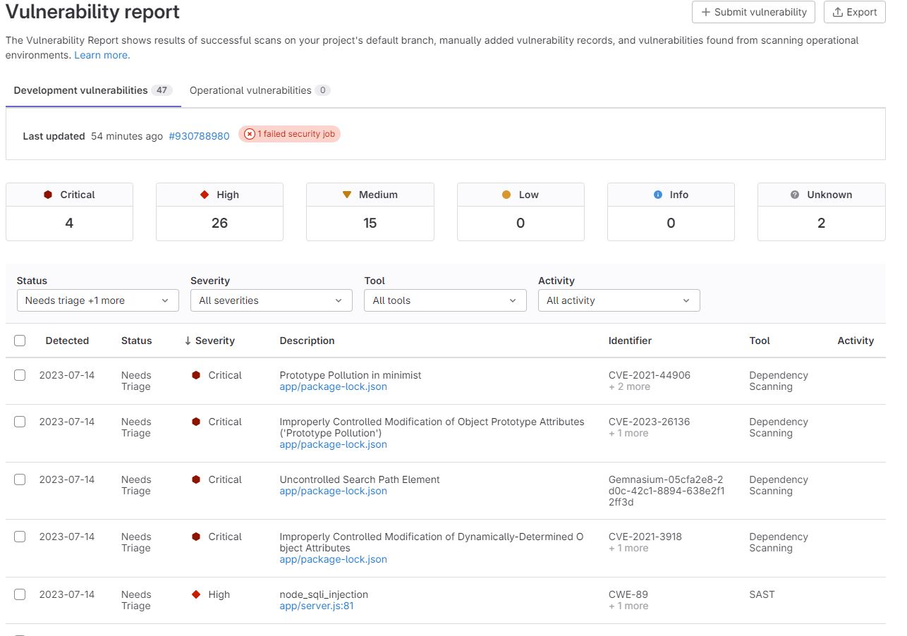
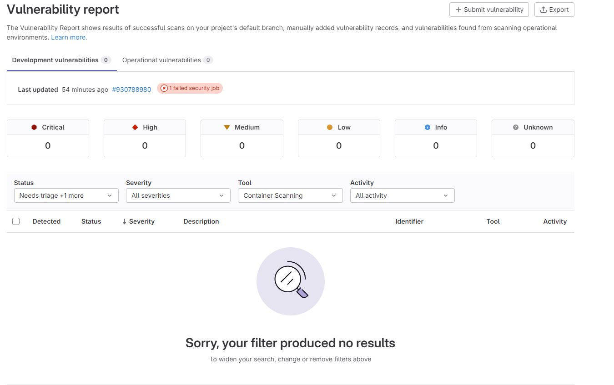

# Домашнее задание к занятию «DevSecOps и AppSec. Часть 2»

Пришлите ответы на вопросы в личном кабинете на сайте [netology.ru](https://netology.ru).

## Описание

Домашнее задание — лабораторная работа, в которой вы по инструкциям выполните действия.

Обратите внимание, что домашнее задание является необязательным. Его выполнение не повлияет на получение зачёта по модулю.

## Задание GitLab

В этом задании применяется сервис GitLab — один из комплексных и самых популярных решений для поддержки DevOps и DevSecOps.

Вы будете использовать пробную версию из облака для упрощения настройки и развёртывания.

Командой GitLab уже подготовлены и настроены инструменты, которые позволяют выполнять действия:
1. Анализировать код на уязвимости — SAST, включая зависимости — SCA или Dependency Scanning.
2. Анализировать контейнеры на уязвимости — Container Scanning.
3. Анализировать используемые в проекте лицензии — License Scanning.
4. Проверять секреты — Secret Detection.

Список всех проверок доступен по адресам:
* https://gitlab.com/gitlab-org/gitlab/-/tree/master/lib/gitlab/ci/templates/Security;
* https://docs.gitlab.com/ee/user/application_security/ (документация).

### Ответьте на вопросы:

**Важно**: после окончания проверки подождите пару минут и несколько раз обновите страницу через `Shift` + `F5`. Иногда не все данные по проверкам подтягиваются сразу. Убедитесь, что уязвимости точно найдены для приложения, зависимостей и контейнера.

**Вопросы для домашнего задания** 

1\. Сколько уязвимостей и какого уровня значимости найдено (Severity)?

2\. Сколько из них:
- в самом приложении (SAST) найдена 1 уязвимость;
- в контейнерах (Container Scanning) уязвимостей не найдено;

- в зависимостях (Dependency Scanning) найдено 29 уязвимостей;
- секретов (Secret Detection) при проверке не найдено

3\. Какая уязвимость найдена в самом приложении?
Untrusted input concatinated with raw SQL query can result in SQL Injection.
CWE-89
node_sqli_injection
4\. Сколько зависимостей в приложении?
Исходя из данных `Dependency list` в приложнии 709 зависимостей.
5\. Сколько различного рода лицензий используется в приложении и его зависимостях?
Исходя из данных `License compliance` в приложeнии используется 12 различных лицензий.